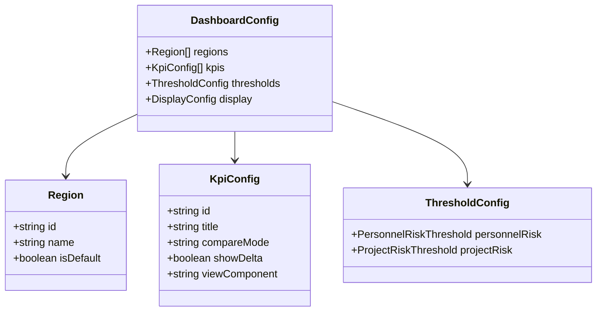
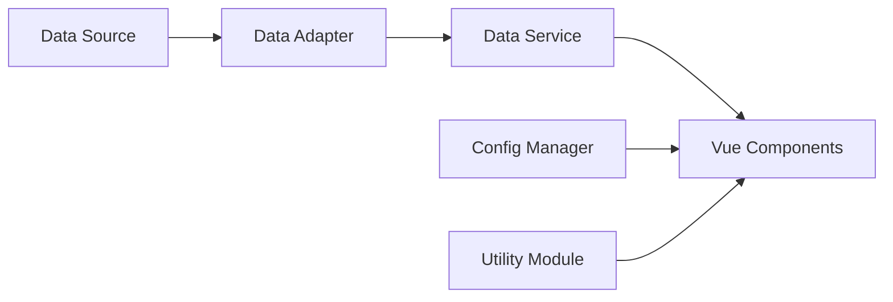

# Design Document

## Overview

本设计文档描述了项目管理系统数据看板的重构方案。重构的核心目标是将硬编码转换为配置驱动，统一数据服务接口，并提取公共代码以减少冗余。

## Architecture

系统采用分层架构：

```
┌─────────────────────────────────────────────────────────────┐
│                      Vue Components                          │
│  (App.vue, KpiGrid, KpiPanel, WatchList, RegularList, etc.) │
└─────────────────────────────────────────────────────────────┘
                              │
                              ▼
┌─────────────────────────────────────────────────────────────┐
│                    Utility Module                            │
│         (formatters.js, calculators.js)                      │
└─────────────────────────────────────────────────────────────┘
                              │
                              ▼
┌─────────────────────────────────────────────────────────────┐
│                   Config Manager                             │
│                   (config.js)                                │
└─────────────────────────────────────────────────────────────┘
                              │
                              ▼
┌─────────────────────────────────────────────────────────────┐
│                    Data Service                              │
│    (dataService.js + dataTypes.js + dataAdapters.js)        │
└─────────────────────────────────────────────────────────────┘
                              │
                              ▼
┌─────────────────────────────────────────────────────────────┐
│                    Data Sources                              │
│              (CSV, API, Database, etc.)                      │
└─────────────────────────────────────────────────────────────┘
```

## Components and Interfaces

### 1. Config Manager (src/config/index.js)

配置管理器负责集中管理所有可配置项。

```javascript
// src/config/index.js
export const dashboardConfig = {
  // 区域配置
  regions: [
    { id: 'all', name: '全国', isDefault: true },
    { id: 'east', name: '华东' },
    { id: 'south', name: '华南' },
    // ... 可动态扩展
  ],
  
  // KPI配置
  kpis: [
    {
      id: 'fund_arrival',
      title: '资金到账率',
      compareMode: null,  // null表示不显示变化量
      showDelta: false,
      viewComponent: 'FundArrivalView'
    },
    {
      id: 'task_completion',
      title: '任务完成率',
      compareMode: 'plan',  // 'plan' | 'period' | null
      showDelta: true,
      viewComponent: 'TaskCompletionView'
    },
    // ... 其他KPI
  ],
  
  // 阈值配置
  thresholds: {
    personnelRisk: {
      projectCountLimit: 3,  // 挂名项目超过此数量判定为风险
      healthyScore: 80,      // 健康度分数阈值
      warningScore: 60
    },
    projectRisk: {
      highRiskOverdueRate: 0.3,
      mediumRiskOverdueRate: 0.15
    }
  },
  
  // 显示配置
  display: {
    defaultKpi: '任务完成率',
    chartHeight: 250,
    listPageSize: 10
  }
}

// 获取配置的辅助函数
export function getKpiConfig(kpiTitle) {
  return dashboardConfig.kpis.find(k => k.title === kpiTitle)
}

export function getRegions() {
  return dashboardConfig.regions
}

export function getThreshold(category, key) {
  return dashboardConfig.thresholds[category]?.[key]
}
```

### 2. Utility Module (src/utils/)

工具模块包含所有公共函数。

```javascript
// src/utils/formatters.js
export function formatPercent(value, decimals = 0) {
  const n = Number(value)
  if (!Number.isFinite(n)) return '0%'
  return Math.round(n * 100).toFixed(decimals) + '%'
}

export function formatCurrency(value, prefix = '¥') {
  const n = Number(value || 0)
  return prefix + ' ' + new Intl.NumberFormat('en-US').format(n)
}

export function formatDate(date, format = 'MM-DD') {
  if (!date) return ''
  const d = new Date(date)
  const mm = String(d.getMonth() + 1).padStart(2, '0')
  const dd = String(d.getDate()).padStart(2, '0')
  if (format === 'MM-DD') return `${mm}-${dd}`
  // 支持更多格式...
}

// src/utils/calculators.js
export function calculateDelta(current, previous) {
  if (previous == null || previous === 0) return { value: 0, isUp: true }
  const delta = current - previous
  return {
    value: Math.abs(delta),
    isUp: delta >= 0
  }
}

export function calculateRate(numerator, denominator) {
  if (!denominator || denominator === 0) return 0
  return numerator / denominator
}

export function getSeriesLastValue(series) {
  if (!Array.isArray(series) || series.length === 0) return 0
  return Number(series[series.length - 1] || 0)
}

export function getSeriesDelta(series) {
  if (!Array.isArray(series) || series.length < 2) return { value: 0, isUp: true }
  const last = Number(series[series.length - 1] || 0)
  const prev = Number(series[series.length - 2] || 0)
  return calculateDelta(last, prev)
}

// src/utils/dateHelpers.js
export function buildDateLabels(length, endDate = new Date()) {
  const labels = []
  const base = new Date(endDate)
  base.setHours(0, 0, 0, 0)
  
  for (let i = length - 1; i >= 0; i--) {
    const d = new Date(base)
    d.setDate(base.getDate() - i)
    labels.push(formatDate(d))
  }
  return labels
}

export function dateRangeInclusive(start, end) {
  const out = []
  if (!start || !end) return out
  const s = new Date(start)
  const e = new Date(end)
  s.setHours(0, 0, 0, 0)
  e.setHours(0, 0, 0, 0)
  for (let d = new Date(s); d <= e; d.setDate(d.getDate() + 1)) {
    out.push(new Date(d))
  }
  return out
}
```

### 3. Data Types (src/services/dataTypes.js)

定义所有数据接口的类型。

```javascript
// src/services/dataTypes.js

/**
 * 项目数据结构
 * @typedef {Object} Project
 * @property {string} id - 项目唯一标识
 * @property {string} name - 项目名称
 * @property {string} [sector] - 所属行业/部门
 * @property {boolean} isWatched - 是否关注
 * @property {number[]} series - 进度指数时间序列
 * @property {Object} [expandedMetrics] - 扩展指标
 */

/**
 * KPI数据结构
 * @typedef {Object} KpiData
 * @property {string} title - KPI标题
 * @property {string} value - 显示值
 * @property {string} [delta] - 变化量
 * @property {boolean} [up] - 是否上升
 */

/**
 * 资金数据结构
 * @typedef {Object} FundData
 * @property {Object} totals - 汇总数据
 * @property {number} totals.totalDueAmount - 总应收金额
 * @property {number} totals.totalReceivedAmount - 已收金额
 * @property {number} totals.totalPendingAmount - 待收金额
 * @property {number} totals.arrivalRate - 到账率
 * @property {Array} fundStages - 款项节点列表
 * @property {Array} overdueItems - 逾期项目列表
 * @property {Object} stats - 统计数据
 */

/**
 * 支出数据结构
 * @typedef {Object} ExpenditureData
 * @property {Object} totals - 汇总数据
 * @property {number} totals.totalBudget - 总预算
 * @property {number} totals.totalExpenditure - 总支出
 * @property {Object} monthlyTrend - 月度趋势
 * @property {string[]} monthlyTrend.xAxis - X轴标签
 * @property {number[]} monthlyTrend.personnel - 人员支出
 * @property {number[]} monthlyTrend.labor - 劳务支出
 * @property {number[]} monthlyTrend.other - 其他支出
 * @property {Array} topExpenditures - 重点支出列表
 */

/**
 * 人员数据结构
 * @typedef {Object} PersonnelData
 * @property {Array} members - 成员列表
 * @property {string} members[].id - 成员ID
 * @property {string} members[].name - 成员姓名
 * @property {string} members[].role - 角色
 * @property {number} members[].projectCount - 参与项目数
 * @property {string[]} members[].projects - 参与项目列表
 */

/**
 * 任务数据结构
 * @typedef {Object} TaskData
 * @property {string[]} xAxis - X轴日期标签
 * @property {number[]} actualRates - 实际完成率序列
 * @property {number[]} planRates - 计划完成率序列
 */

/**
 * 创建空的数据结构
 */
export const emptyStructures = {
  project: () => ({
    id: '',
    name: '',
    sector: '',
    isWatched: false,
    series: [],
    expandedMetrics: null
  }),
  
  kpi: () => ({
    title: '',
    value: '0%',
    delta: '0%',
    up: true
  }),
  
  fundData: () => ({
    totals: {
      totalDueAmount: 0,
      totalReceivedAmount: 0,
      totalPendingAmount: 0,
      arrivalRate: 0
    },
    fundStages: [],
    overdueItems: [],
    stats: { last: 0, prev: null, planLast: null, isUp: true }
  }),
  
  expenditureData: () => ({
    totals: { totalBudget: 0, totalExpenditure: 0 },
    monthlyTrend: { xAxis: [], personnel: [], labor: [], other: [] },
    topExpenditures: []
  }),
  
  personnelData: () => ({
    members: []
  }),
  
  taskData: () => ({
    xAxis: [],
    actualRates: [],
    planRates: []
  })
}
```

### 4. Data Service Interface (src/services/dataService.js)

重构后的数据服务层。

```javascript
// src/services/dataService.js
import { emptyStructures } from './dataTypes'
import { dashboardConfig } from '../config'

// 数据适配器接口
let dataAdapter = null

/**
 * 设置数据适配器
 * @param {Object} adapter - 数据适配器实现
 */
export function setDataAdapter(adapter) {
  dataAdapter = adapter
}

/**
 * 获取项目列表
 * @returns {Promise<Project[]>}
 */
export async function getProjects() {
  if (!dataAdapter?.getProjects) {
    console.warn('[dataService] No adapter configured for getProjects')
    return []
  }
  try {
    return await dataAdapter.getProjects()
  } catch (e) {
    console.error('[dataService] getProjects failed:', e)
    return []
  }
}

/**
 * 获取KPI数据
 * @param {string} projectId - 项目ID
 * @returns {Promise<KpiData[]>}
 */
export async function getKpis(projectId) {
  if (!dataAdapter?.getKpis) {
    // 返回配置中定义的KPI的默认值
    return dashboardConfig.kpis.map(kpi => ({
      ...emptyStructures.kpi(),
      title: kpi.title
    }))
  }
  try {
    return await dataAdapter.getKpis(projectId)
  } catch (e) {
    console.error('[dataService] getKpis failed:', e)
    return dashboardConfig.kpis.map(kpi => ({
      ...emptyStructures.kpi(),
      title: kpi.title
    }))
  }
}

// ... 其他接口方法遵循相同模式
```

## Data Models

### 配置数据模型



### 数据流模型



## Correctness Properties

*A property is a characteristic or behavior that should hold true across all valid executions of a system—essentially, a formal statement about what the system should do. Properties serve as the bridge between human-readable specifications and machine-verifiable correctness guarantees.*

### Property 1: 配置完整性

*For any* dashboard configuration object, it SHALL contain all required configuration sections (regions, kpis, thresholds, display) with valid values.

**Validates: Requirements 1.1, 1.2, 1.3, 1.4**

### Property 2: 配置往返一致性

*For any* valid configuration object, serializing to JSON then deserializing SHALL produce an equivalent configuration object.

**Validates: Requirements 1.6**

### Property 3: 数据结构符合接口定义

*For any* data returned by Data_Service methods (getProjects, getKpis, getFundData, getExpenditureData, getPersonnelData, getTaskData), the returned data structure SHALL conform to the corresponding type definition.

**Validates: Requirements 2.1, 2.2, 2.3, 2.4, 2.5, 2.6, 6.4**

### Property 4: 空数据源返回有效空结构

*For any* Data_Service method called when the data adapter is null or returns empty data, the method SHALL return a valid empty data structure that conforms to the interface definition.

**Validates: Requirements 2.7, 7.2**

### Property 5: 数值格式化有效性

*For any* numeric input (including NaN, Infinity, negative numbers, zero), the formatPercent and formatCurrency functions SHALL return a valid string without throwing errors.

**Validates: Requirements 4.1**

### Property 6: 日期格式化有效性

*For any* valid Date object, the formatDate function SHALL return a string matching the expected format pattern.

**Validates: Requirements 4.2**

### Property 7: 百分比计算边界安全

*For any* numerator and denominator values (including zero denominator), the calculateRate function SHALL return a finite number without throwing errors.

**Validates: Requirements 4.3**

### Property 8: 变化量计算正确性

*For any* two numeric values (current, previous), the calculateDelta function SHALL return an object with correct delta value and direction (isUp).

**Validates: Requirements 4.4**

### Property 9: 日期标签生成一致性

*For any* positive integer length and valid end date, buildDateLabels SHALL return an array of exactly that length with dates in ascending order.

**Validates: Requirements 4.2**

## Error Handling

### 数据加载错误处理

```javascript
// src/services/errorHandler.js
export class DataLoadError extends Error {
  constructor(message, source, originalError) {
    super(message)
    this.name = 'DataLoadError'
    this.source = source
    this.originalError = originalError
  }
}

export function handleDataError(error, context) {
  console.error(`[${context}] Data error:`, error)
  
  return {
    hasError: true,
    errorMessage: getErrorMessage(error),
    canRetry: isRetryable(error)
  }
}

function getErrorMessage(error) {
  if (error instanceof DataLoadError) {
    return `数据加载失败: ${error.source}`
  }
  if (error.message?.includes('network')) {
    return '网络连接失败，请检查网络后重试'
  }
  return '数据加载失败，请稍后重试'
}

function isRetryable(error) {
  // 网络错误可重试，数据格式错误不可重试
  return error.message?.includes('network') || 
         error.message?.includes('timeout')
}
```

### 组件错误边界

```javascript
// 在Vue组件中使用错误处理
export default {
  data() {
    return {
      loadError: null,
      isLoading: false
    }
  },
  
  methods: {
    async loadData() {
      this.isLoading = true
      this.loadError = null
      
      try {
        this.data = await dataService.getData()
      } catch (e) {
        this.loadError = handleDataError(e, 'ComponentName')
      } finally {
        this.isLoading = false
      }
    },
    
    retry() {
      if (this.loadError?.canRetry) {
        this.loadData()
      }
    }
  }
}
```

### 空状态处理

```vue
<!-- 空状态组件模板 -->
<template>
  <div v-if="loadError" class="error-state">
    <p>{{ loadError.errorMessage }}</p>
    <button v-if="loadError.canRetry" @click="retry">重试</button>
  </div>
  <div v-else-if="isEmpty" class="empty-state">
    <p>暂无数据</p>
  </div>
  <div v-else>
    <!-- 正常内容 -->
  </div>
</template>
```

## Testing Strategy

### 测试框架选择

- **单元测试**: Vitest (与Vite生态系统集成)
- **属性测试**: fast-check (JavaScript属性测试库)
- **组件测试**: @vue/test-utils

### 单元测试策略

单元测试用于验证特定示例和边界条件：

1. **工具函数测试** - 测试formatters.js和calculators.js中的函数
2. **配置管理测试** - 测试配置加载和访问
3. **数据服务测试** - 测试数据适配器接口
4. **组件测试** - 测试Vue组件的渲染和交互

### 属性测试策略

属性测试用于验证通用属性在所有输入上成立：

```javascript
// 示例：使用fast-check进行属性测试
import fc from 'fast-check'
import { formatPercent, calculateDelta } from '../utils/calculators'

// Property 5: 数值格式化有效性
describe('formatPercent property tests', () => {
  it('should return valid string for any number', () => {
    fc.assert(
      fc.property(fc.double(), (n) => {
        const result = formatPercent(n)
        return typeof result === 'string' && result.endsWith('%')
      }),
      { numRuns: 100 }
    )
  })
})

// Property 8: 变化量计算正确性
describe('calculateDelta property tests', () => {
  it('should return correct delta and direction', () => {
    fc.assert(
      fc.property(fc.double(), fc.double(), (current, previous) => {
        const result = calculateDelta(current, previous)
        return (
          typeof result.value === 'number' &&
          typeof result.isUp === 'boolean' &&
          result.isUp === (current >= previous)
        )
      }),
      { numRuns: 100 }
    )
  })
})
```

### 测试配置

```javascript
// vitest.config.js
export default {
  test: {
    environment: 'jsdom',
    globals: true,
    coverage: {
      provider: 'v8',
      reporter: ['text', 'json', 'html']
    }
  }
}
```

### 测试文件组织

```
src/
├── utils/
│   ├── formatters.js
│   ├── formatters.test.js      # 单元测试
│   ├── formatters.property.test.js  # 属性测试
│   ├── calculators.js
│   └── calculators.test.js
├── config/
│   ├── index.js
│   └── index.test.js
├── services/
│   ├── dataService.js
│   ├── dataService.test.js
│   └── dataTypes.test.js
└── components/
    └── __tests__/
        ├── KpiGrid.test.js
        └── WatchList.test.js
```
